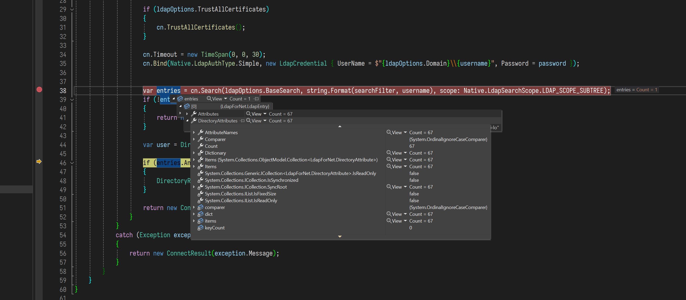
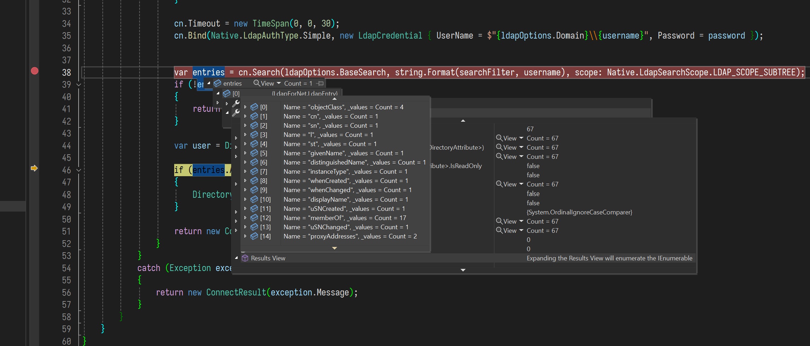
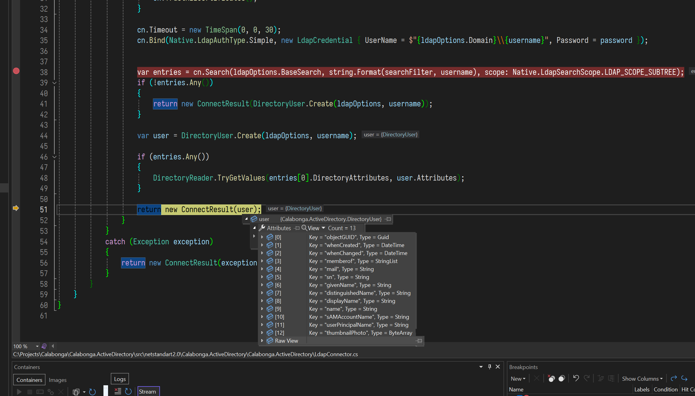

# Calabonga.ActiveDirectory

Новый nuget-пакет, который позволяет кроссплатформенно обращаться к `Active Directory` для аутентификации пользователей через `LDAP`.

Пришлось реализовать функционал, который позволяет кроссплатформенно обращаться к `Active Directory` для аутентификации пользователей через `LDAP`. На базе этой реализации получился новый nuget-пакет, который я и хочу представить в этом видео.

Simple Active directory connection helper built-on another nuget-package `LdapForNet`. Attributes parser added for some types.

# Platform

netstandard2.0

# Снимки с экрана

> Прошу прощения, на примерах нет реальных данных, полагаю, что вы понимаете, что это сделано в целях безопастности.

**Получение Domain Entiry (LdapEntry)**

**Названия атрибутов в Domain Entiry (LdapEntry)**

**Преобразование в атрибуты пользователья для DirectoryUser**

